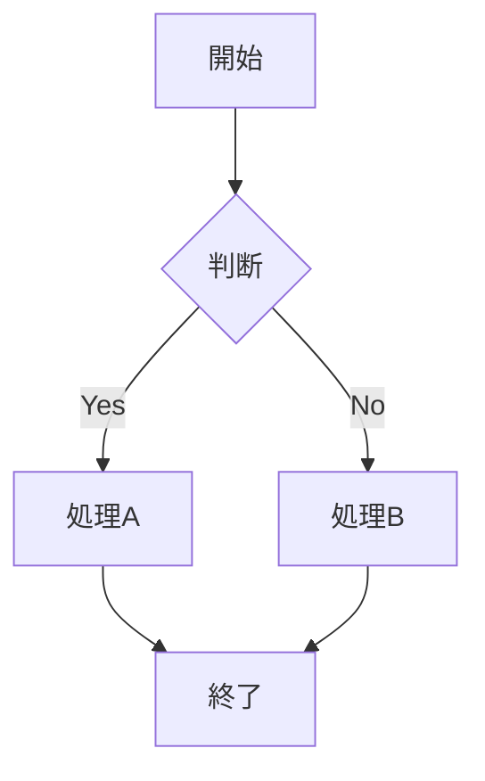

# 御籠り
## 12月27日　基地設営

👬  
🕛  
🛻  
🏫　オクトピア  

### 作業内容

| 🔴基地の設営 | 🔵物資搬入 |
|---|---|
| 名前 | サンプル |
| 状態 | 🟡 作業中 |
| 担当 | Aさん |

## 12月28日

## 12月29日

## 12月30日 

## 12月31日17:00〜火入れ式〜御籠り本番

🔴フリー遊撃班

祐輔、紀夫、カツマサ（タップで開く）

 
・基本的にフリー  
・人手不足のヘルプ  
・０時過ぎ頃、新年の挨拶

🔥御神火班

田中、徳田（タップで開く）

 
＠火入れ式準備  
 →松明2本用意

##  片付け

あああ

