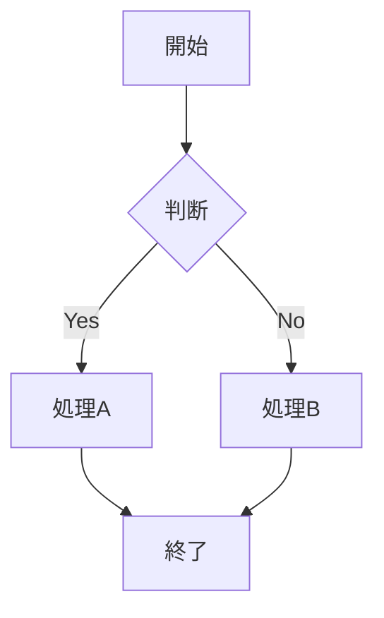

# 御籠り

## 12月27日　基地設営
👬　祐輔、紀夫、柿田、カツマサ、タカヤ  
🕛　9:00〜正午予定  
🏫　オクトピア  

### オクトピア内の基地設営
- ブルーシートの設置
- 机、椅子の設置
- その他(冷蔵庫など)の設置
- 発注品の受領

### 準備期間の休憩物資準備
- お茶500mlボトル ー24本x2箱
- ボトルコーヒー
- お菓子

|**memo** 20時頃 保存会の練習休憩時間に挨拶とお菓子の差し入れ|
|:-|

## 12月28日　境内準備、物品仕分け

👬　全員  
🕛　9:00〜終日(終わるまで)  
🏫　オクトピア  
🚙　2tトラックx2台  軽トラx1台
 
### ⛩️境内準備
 
- 机、椅子の養生(オクトピア内で作業)
- オクトピアから運搬
- ハソリ、テントの運搬
  - 旧市役所
- 消防用ポンプ、ホース(6本)の借用
  - 魚楽近くの消防倉庫

### 🗃️物品受領、仕分け
 
- マンセイ堂、キヨハチ、和さんからの物品受領
- 物品の仕分け

## 12月29日

## 12月30日 

## 12月31日17:00〜火入れ式〜御籠り本番

🔴フリー遊撃班

祐輔、紀夫、カツマサ（タップで開く）

 
・基本的にフリー  
・人手不足のヘルプ  
・０時過ぎ頃、新年の挨拶

***  

🔥御神火班

田中、徳田（タップで開く）

 
＠火入れ式準備  
 →松明2本用意

***  

🍶お神酒班

ヒロヤス、いくや（タップで開く）

 
＠お神酒を参拝客に振る舞う

***  

🍢振る舞い班

柿田、中井、まっとー（タップで開く）

 
＠おでんを参拝客に振る舞う

***  

🥳接待班

ヒロヤス、いくや（タップで開く）

 
＠テント内で接待
→残飯、ゴミ箱の案内など

***  

🍬お菓子班

タカヤ、シュンスケ(24厄(（タップで開く）

 
＠参拝の帰りに、お菓子を配る

##  片付け

あああ

